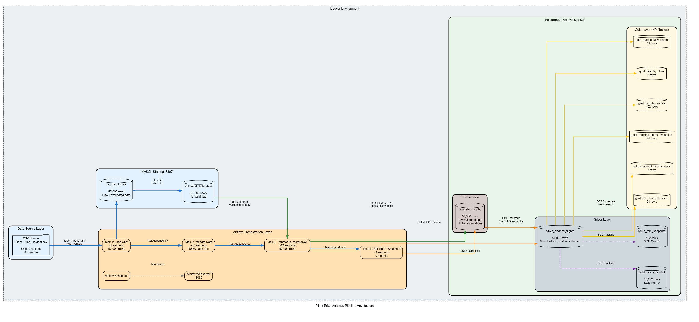

# DEM06_DATA_TRANSFORMS
# Flight Price Analysis Pipeline

## Project Overview

An end-to-end data pipeline that processes and analyzes flight price data for Bangladesh using Apache Airflow for orchestration and DBT for transformations. The pipeline implements a medallion architecture (Bronze/Silver/Gold) with SCD Type 2 for historical tracking.

---

## Architecture

```

```

---

## Technologies

| Component | Technology | Purpose |
|-----------|-----------|---------|
| Orchestration | Apache Airflow 2.7.3 | Workflow scheduling and monitoring |
| Staging Database | MySQL 8.0 | Raw data landing and validation |
| Analytics Database | PostgreSQL 15 | Data warehouse with medallion architecture |
| Transformation | DBT 1.7.4 | SQL-based transformations and testing |
| Data Processing | Python 3.10, Pandas | Data ingestion and validation |
| Infrastructure | Docker Compose | Containerized deployment |

---

## Data Pipeline Flow

### 1. Data Ingestion
- **Input**: `Flight_Price_Dataset_of_Bangladesh.csv` (57,000 records, 18 columns)
- **Process**: Python reads CSV, renames columns, converts data types
- **Output**: MySQL `raw_flight_data` table
- **Duration**: ~8 seconds

### 2. Data Validation
- **Input**: MySQL `raw_flight_data`
- **Validation Rules**:
  - Required fields not null (airline, source, destination)
  - Positive fare values
  - Valid IATA codes (3 characters)
  - Positive duration and booking lead time
  - Flexible categorical matching (accepts any seasonality/class values)
- **Output**: MySQL `validated_flight_data` with `is_valid` flag
- **Duration**: ~10 seconds

### 3. Data Transfer
- **Input**: MySQL `validated_flight_data`
- **Process**: Extract validated records, convert boolean types, load to PostgreSQL
- **Output**: PostgreSQL `bronze.validated_flights`
- **Duration**: ~12 seconds

### 4. DBT Transformations
- **Input**: PostgreSQL Bronze layer
- **Process**: 
  - Silver: Clean, standardize, add derived columns
  - Gold: Compute KPIs and aggregations
  - Snapshots: Track historical changes (SCD Type 2)
- **Output**: Silver and Gold tables
- **Duration**: ~4 seconds

---

## Medallion Architecture

### Bronze Layer (Raw)
- **Table**: `bronze.validated_flights`
- **Content**: Validated data from MySQL, unchanged
- **Row Count**: 57,000

### Silver Layer (Cleaned)
- **Table**: `silver.silver_cleaned_flights`
- **Transformations**:
  - Filter to valid records only
  - Standardize text (proper case, trimming)
  - Add derived columns: route, fare_category, booking_window, route_type, is_peak_season
  - Parse time dimensions
- **Row Count**: 57,000 (100% valid after flexible validation)

### Gold Layer (Business Metrics)

| Table | Description | Rows |
|-------|-------------|------|
| `gold_avg_fare_by_airline` | Fare statistics per airline | 24 |
| `gold_seasonal_fare_analysis` | Fare comparison across seasons | 4 |
| `gold_booking_count_by_airline` | Booking volume by airline | 24 |
| `gold_popular_routes` | Top routes by booking count | 152 |
| `gold_fare_by_class` | Fare analysis by travel class | 3 |
| `gold_data_quality_report` | Categorical value tracking | 13 |
| `gold_fare_history` | Historical fare changes (view) | - |
| `gold_route_history` | Historical route metrics (view) | - |

---

## SCD Type 2 Implementation

### Snapshots
- **`silver.flight_fare_snapshot`**: Tracks fare changes by airline/route/class/season (19,052 records)
- **`silver.route_fare_snapshot`**: Tracks route-level metric changes (152 records)

### Tracked Columns
- Average fares (base, total)
- Booking counts
- Route metrics

### SCD Columns (Auto-generated by DBT)
- `dbt_valid_from`: When this version became active
- `dbt_valid_to`: When this version was superseded (NULL if current)
- `dbt_scd_id`: Unique identifier for each version
- `dbt_updated_at`: Timestamp of snapshot run

---

## Key Performance Indicators

### 1. Average Fare by Airline
- Average, min, max, median fares
- Fare distribution by class and route type
- Peak vs off-peak fare comparison
- Market share percentage

### 2. Seasonal Fare Analysis
- Fare comparison across seasons (Regular, Eid, Hajj, Winter Holidays)
- Percentage difference from regular season
- Breakdown by route type and travel class

### 3. Booking Count by Airline
- Total bookings by source (direct, agency, online)
- Booking window distribution (last minute, advance, early bird)
- Peak vs off-peak booking counts
- Religious vs seasonal holiday breakdown

### 4. Popular Routes
- Top routes by booking volume
- Fare statistics per route
- Direct vs connecting flight distribution
- Peak season premium calculation

### 5. Fare by Class
- Fare comparison across Economy, Business, First
- Domestic vs international breakdown
- Peak season premium by class

---

## Data Quality Features

### Validation Strategy
- **Hard Rules**: Reject records with nulls, negative values, invalid data types
- **Soft Rules**: Accept but warn on unexpected categorical values (new holidays, classes)

### Flexible Pattern Matching
- Seasonality: Accepts any value containing holiday indicators (Eid, Hajj, Winter, Holiday, Festival, etc.)
- Travel Class: Standardizes variations (First Class → First, Premium Economy → Premium Economy)
- New categories automatically handled without code changes

### Audit Logging
- **Table**: `audit.pipeline_runs`
- **Tracks**: Task execution, row counts, durations, errors
- **Purpose**: Pipeline monitoring and debugging

---

## Project Structure

```
flight_price_pipeline/
│
├── docker-compose.yml              # Container orchestration
├── Dockerfile.airflow              # Custom Airflow image
├── .env                            # Environment variables
│
├── dags/
│   ├── flight_pipeline_dag.py      # Main Airflow DAG
│   └── utils/
│       └── logging_utils.py        # Custom logging functions
│
├── dbt_project/
│   ├── dbt_project.yml             # DBT configuration
│   ├── profiles.yml                # Database connections
│   ├── models/
│   │   ├── sources.yml             # Source definitions
│   │   ├── silver/
│   │   │   ├── silver_cleaned_flights.sql
│   │   │   └── schema.yml
│   │   └── gold/
│   │       ├── gold_avg_fare_by_airline.sql
│   │       ├── gold_seasonal_fare_analysis.sql
│   │       ├── gold_booking_count_by_airline.sql
│   │       ├── gold_popular_routes.sql
│   │       ├── gold_fare_by_class.sql
│   │       ├── gold_data_quality_report.sql
│   │       ├── gold_fare_history.sql
│   │       ├── gold_route_history.sql
│   │       └── schema.yml
│   ├── snapshots/
│   │   ├── flight_fare_snapshot.sql
│   │   └── route_fare_snapshot.sql
│   └── macros/
│       └── get_custom_schema.sql   # Custom schema naming
│
├── data/
│   └── Flight_Price_Dataset_of_Bangladesh.csv
│
├── scripts/
│   ├── init_mysql.sql              # MySQL initialization
│   └── init_postgres.sql           # PostgreSQL initialization
│
└── logs/                           # Airflow logs
```

---

## Setup Instructions

### Prerequisites
- Docker and Docker Compose installed
- 8GB RAM minimum
- Ports available: 8080 (Airflow), 3307 (MySQL), 5433 (PostgreSQL)

### Installation

1. **Clone and navigate to project directory**
```bash
cd flight_price_pipeline
```

2. **Download dataset**
- Source: [Kaggle - Flight Price Dataset of Bangladesh](https://www.kaggle.com/datasets/mahatiratusher/flight-price-dataset-of-bangladesh)
- Place in `data/Flight_Price_Dataset_of_Bangladesh.csv`

3. **Start services**
```bash
docker-compose up -d
```

4. **Wait for initialization** (2-3 minutes)
```bash
docker-compose ps
```

5. **Add Airflow database connections**
```bash
# MySQL connection
docker exec -it airflow-webserver airflow connections add 'mysql_staging' \
    --conn-type 'mysql' \
    --conn-host 'mysql' \
    --conn-schema 'flight_staging' \
    --conn-login 'flight_user' \
    --conn-password 'flight_pass' \
    --conn-port '3306'

# PostgreSQL connection
docker exec -it airflow-webserver airflow connections add 'postgres_analytics' \
    --conn-type 'postgres' \
    --conn-host 'postgres-analytics' \
    --conn-schema 'flight_analytics' \
    --conn-login 'analytics_user' \
    --conn-password 'analytics_pass' \
    --conn-port '5432'
```

6. **Access Airflow UI**
- URL: http://localhost:8080
- Username: `admin`
- Password: `admin`

7. **Trigger the pipeline**
```bash
docker exec -it airflow-webserver airflow dags unpause flight_price_pipeline
docker exec -it airflow-webserver airflow dags trigger flight_price_pipeline
```

---

## Database Access

### MySQL (Staging)
```bash
docker exec -it mysql-staging mysql -u flight_user -pflight_pass flight_staging
```

### PostgreSQL (Analytics)
```bash
docker exec -it postgres-analytics psql -U analytics_user -d flight_analytics
```

**External connections:**
- MySQL: `localhost:3307`
- PostgreSQL: `localhost:5433`

---

## Verification Queries

### Check row counts across layers
```sql
SELECT 'bronze.validated_flights' as table_name, COUNT(*) as rows FROM bronze.validated_flights
UNION ALL
SELECT 'silver.silver_cleaned_flights', COUNT(*) FROM silver.silver_cleaned_flights
UNION ALL
SELECT 'gold.gold_avg_fare_by_airline', COUNT(*) FROM gold.gold_avg_fare_by_airline;
```

### View top airlines by bookings
```sql
SELECT airline, total_bookings, avg_total_fare, market_share_pct
FROM gold.gold_avg_fare_by_airline
ORDER BY total_bookings DESC
LIMIT 10;
```

### Check seasonal fare differences
```sql
SELECT seasonality, total_bookings, avg_fare, pct_diff_from_regular
FROM gold.gold_seasonal_fare_analysis
ORDER BY total_bookings DESC;
```

### View SCD snapshot status
```sql
SELECT 
    COUNT(*) as total_records,
    COUNT(*) FILTER (WHERE dbt_valid_to IS NULL) as current_records,
    COUNT(*) FILTER (WHERE dbt_valid_to IS NOT NULL) as historical_records
FROM silver.flight_fare_snapshot;
```

---

## Pipeline Performance

| Metric | Value |
|--------|-------|
| Total Pipeline Duration | ~34 seconds |
| Source Records | 57,000 |
| Valid Records | 57,000 (100%) |
| Airlines | 24 |
| Unique Routes | 152 |
| DBT Models | 9 |
| DBT Tests | 22 (all passing) |
| SCD Snapshots | 2 |

---

## Challenges and Solutions

### Challenge 1: Foreign Key Constraint on Truncate
**Issue**: MySQL `TRUNCATE` failed due to foreign key from `validated_flight_data` to `raw_flight_data`.

**Solution**: Disable foreign key checks within a single connection:
```python
conn = mysql_hook.get_conn()
cursor = conn.cursor()
cursor.execute("SET FOREIGN_KEY_CHECKS = 0")
cursor.execute("TRUNCATE TABLE validated_flight_data")
cursor.execute("TRUNCATE TABLE raw_flight_data")
cursor.execute("SET FOREIGN_KEY_CHECKS = 1")
conn.commit()
```

### Challenge 2: Boolean Type Mismatch
**Issue**: MySQL stores boolean as TINYINT (0/1), PostgreSQL expects TRUE/FALSE.

**Solution**: Explicit type conversion before transfer:
```python
df['is_valid'] = df['is_valid'].astype(bool)
```

### Challenge 3: Hardcoded Validation Rules
**Issue**: Initial validation rejected records with unexpected values (e.g., "Winter Holidays" vs "Winter").

**Solution**: Implemented flexible pattern matching:
- Accept any seasonality value
- Use LIKE patterns for peak season detection (`LIKE '%WINTER%'`, `LIKE '%HOLIDAY%'`)
- Standardize known variations, keep unknown values as-is

### Challenge 4: DBT Schema Naming
**Issue**: DBT created `public_silver` and `public_gold` schemas instead of `silver` and `gold`.

**Solution**: Created custom macro `generate_schema_name` to override default behavior:
```sql

    
        {{ target.schema }}
    
        {{ custom_schema_name | trim }}
    

```

---

## Future Enhancements

- Add incremental loading for large datasets
- Add more granular SCD tracking (hourly snapshots)
- Integrate with cloud storage (S3/GCS) for CSV source

---

## Testing

### Run DBT tests
```bash
docker exec -it airflow-webserver bash -c "cd /opt/airflow/dbt_project && dbt test --profiles-dir ."
```

### Run full pipeline
```bash
docker exec -it airflow-webserver airflow dags trigger flight_price_pipeline
```

### Check audit logs
```sql
SELECT task_id, status, rows_processed, rows_failed, started_at
FROM audit.pipeline_runs
ORDER BY id DESC
LIMIT 10;
```

---

## Cleanup

```bash
# Stop all services
docker-compose down

# Remove volumes (deletes all data)
docker-compose down -v
```

---

## License

This project is for educational purposes.

---

## Author

Carl Nyameakyere Crankson

---

## Acknowledgments

- Dataset: [Kaggle - Flight Price Dataset of Bangladesh](https://www.kaggle.com/datasets/mahatiratusher/flight-price-dataset-of-bangladesh)
- Technologies: Apache Airflow, DBT, PostgreSQL, MySQL