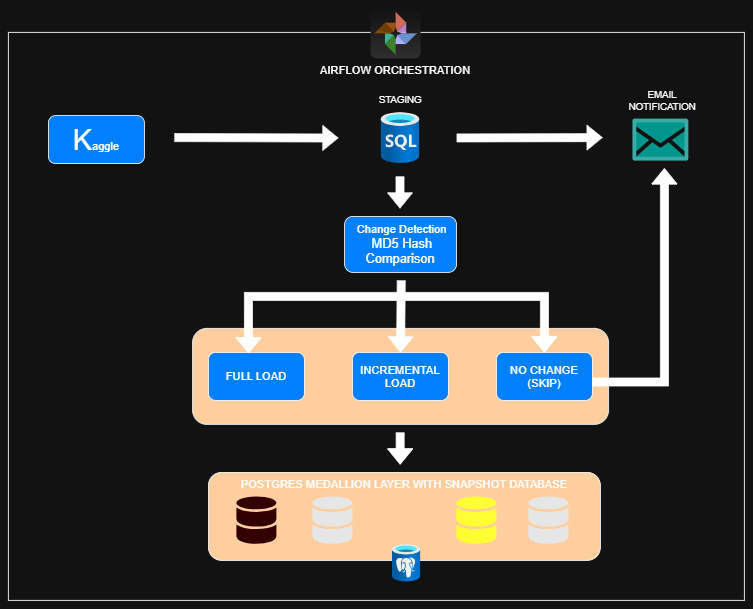

# Flight Price Data Pipeline
## Production ETL with Intelligent Incremental Loading
---

## Overview

Enterprise-grade ETL pipeline processing 57,000 flight records using **Apache Airflow**, **DBT**, and **intelligent incremental loading** for 60-75% performance improvement over traditional full reloads.

### Key Features
- ⚡ **60-75% faster** - MD5 hash-based change detection
- 🔄 **Smart Processing** - Skips DBT when no data changes
- 📧 **Email Alerts** - 3 notifications per run with detailed stats
- 🏗️ **Medallion Architecture** - Bronze → Silver → Gold layers
- 📸 **SCD Type 2** - Historical tracking with DBT snapshots
- ✅ **Data Quality** - 22 automated tests

---

## Architecture



---

## Performance

| Scenario | Traditional | Incremental | Time Saved |
|----------|-------------|-------------|------------|
| No changes | 15s | 5s | **67%** ⚡ |
| 5% changes | 15s | 7s | **53%** ⚡ |
| 50% changes | 15s | 12s | **20%** ⚡ |

---

## Quick Start

```bash
# 1. Clone and configure
git clone <repo>
cd flight_price_pipeline
cp .env.example .env  # Add Kaggle credentials

# 2. Start services
docker-compose up -d

# 3. Configure Airflow (after 2 min)
docker exec -it airflow-webserver airflow connections add postgres_analytics \
    --conn-type postgres --conn-host postgres-analytics --conn-port 5432 \
    --conn-login analytics_user --conn-password analytics_pass \
    --conn-schema flight_analytics

docker exec -it airflow-webserver airflow connections add mysql_staging \
    --conn-type mysql --conn-host mysql-staging --conn-port 3306 \
    --conn-login staging_user --conn-password staging_pass \
    --conn-schema flight_staging

# 4. Run pipeline
docker exec -it airflow-webserver airflow dags trigger flight_price_pipeline
```

**Access**: http://localhost:8080 (admin/admin)

---

## Data Flow

```
Extract (Kaggle) → Load (MySQL) → Validate → Transfer (PostgreSQL)
                                                      ↓
                                          Change Detection (MD5)
                                                      ↓
                               ┌──────────────────────┴──────────────┐
                               │                                     │
                          No Changes                          Changes Detected
                               │                                     │
                        Skip Processing                    DBT Transform
                               │                                     │
                               └──────────────────┬──────────────────┘
                                                  ↓
                                         Email Notification
```

---

## Tech Stack

| Layer | Technology | Purpose |
|-------|-----------|---------|
| **Orchestration** | Airflow 2.7.3 | Workflow management |
| **Staging** | MySQL 8.0 | Raw data validation |
| **Warehouse** | PostgreSQL 15 | Analytics database |
| **Transform** | DBT 1.7.4 | SQL transformations |
| **Processing** | Python 3.10 | Data ingestion |

---

## Data Layers

### Bronze (Raw)
- **Table**: `bronze.validated_flights`
- **Rows**: 57,000 active records
- **Tracking**: `record_hash`, `is_active`, `ingestion_timestamp`

### Silver (Cleaned)
- **Table**: `silver.silver_cleaned_flights`
- **Features**: Standardized text, derived columns (route, fare_category)
- **Quality**: 100% valid records

### Gold (Business Metrics)
| Table | Records | Description |
|-------|---------|-------------|
| `gold_avg_fare_by_airline` | 24 | Airline pricing analysis |
| `gold_seasonal_fare_analysis` | 4 | Seasonal trends |
| `gold_popular_routes` | 152 | Route performance |
| `gold_fare_by_class` | 3 | Class comparison |

---

## Incremental Loading

### How It Works
```python
1. Calculate MD5 hash for each record
2. Compare with existing database records
3. Classify as: NEW | UPDATED | DELETED | UNCHANGED
4. Apply changes efficiently (INSERT/UPDATE/soft DELETE)
5. If >50% changed → Full reload for efficiency
```

### Change Detection Thresholds
- **<50% changes**: Incremental update
- **≥50% changes**: Full reload
- **0% changes**: Skip DBT transformations

---

## Email Notifications

### 1. Pipeline Start
Basic execution details and scheduled tasks

### 2. Change Detection (Color-coded)
```
🔵 0% change   → No changes detected
🟢 <5% change  → Minor updates  
🟠 5-50%       → Moderate updates
🔴 ≥50%        → Major update (full reload)
```
Includes: records inserted/deleted, change %, execution time

### 3. Completion Summary
Final status, duration, task completion table

---

## Configuration

**Environment Variables** (`.env`):
```bash
# Required
KAGGLE_USERNAME=your_username
KAGGLE_KEY=your_api_key

# Email (Optional)
AIRFLOW_SMTP_PASSWORD=your_gmail_app_password

# Auto-configured
MYSQL_USER=staging_user
POSTGRES_ANALYTICS_USER=analytics_user
```

**Email Setup**: Get Gmail App Password at https://myaccount.google.com/apppasswords

---

## Monitoring

```sql
-- Check pipeline status
SELECT task_id, status, rows_processed, started_at 
FROM audit.pipeline_runs 
ORDER BY id DESC LIMIT 5;

-- View load history
SELECT load_type, change_percentage, execution_time_seconds
FROM bronze.data_load_metadata 
ORDER BY load_timestamp DESC;

-- Check data quality
SELECT COUNT(*) as total, 
       COUNT(*) FILTER (WHERE is_active) as active
FROM bronze.validated_flights;
```

---

## Key Metrics

| Metric | Value |
|--------|-------|
| **Records Processed** | 57,000 |
| **Valid Records** | 100% |
| **Airlines Tracked** | 24 |
| **Routes Analyzed** | 152 |
| **DBT Models** | 9 |
| **Automated Tests** | 22 (all passing) |
| **Avg Pipeline Time** | 30-35s (incremental) |

---

## Project Structure

```
flight_price_pipeline/
├── dags/
│   ├── flight_pipeline_dag.py      # Main DAG
│   └── utils/
│       └── incremental_loader.py   # MD5 change detection
├── dbt_project/
│   ├── models/                     # SQL transformations
│   └── snapshots/                  # SCD Type 2
├── scripts/
│   ├── init_mysql.sql              # MySQL schema
│   └── init_postgres.sql           # PostgreSQL schema
├── docker-compose.yml              # Infrastructure
└── .env                            # Configuration
```

---

## Troubleshooting

**Pipeline shows 100% change every run**
```sql
-- Verify hashes are being created
SELECT record_hash, COUNT(*) FROM bronze.validated_flights 
GROUP BY record_hash LIMIT 5;
```

**Email notifications not working**
```bash
# Test SMTP configuration
docker exec -it airflow-scheduler env | grep SMTP
```

**DBT transformations failing**
```bash
docker exec -it airflow-webserver bash -c \
  "cd /opt/airflow/dbt_project && dbt test --profiles-dir ."
```

---

## Database Access

**PostgreSQL** (Analytics):
```bash
docker exec -it postgres-analytics psql -U analytics_user -d flight_analytics
# External: localhost:5433
```

**MySQL** (Staging):
```bash
docker exec -it mysql-staging mysql -u staging_user -pstaging_pass flight_staging
# External: localhost:3307
```

---

## Cleanup

```bash
# Stop services
docker-compose down

# Remove all data
docker-compose down -v
```

---

## Requirements

- Docker & Docker Compose
- 8GB RAM
- Ports: 8080, 3307, 5433
- Kaggle API credentials

---

## Author

**Carl Nyameakyere Crankson**  
Data Engineer

---

## License

Educational purposes only.

---

**Dataset**: [Kaggle - Bangladesh Flight Prices](https://www.kaggle.com/datasets/mahatiratusher/flight-price-dataset-of-bangladesh)